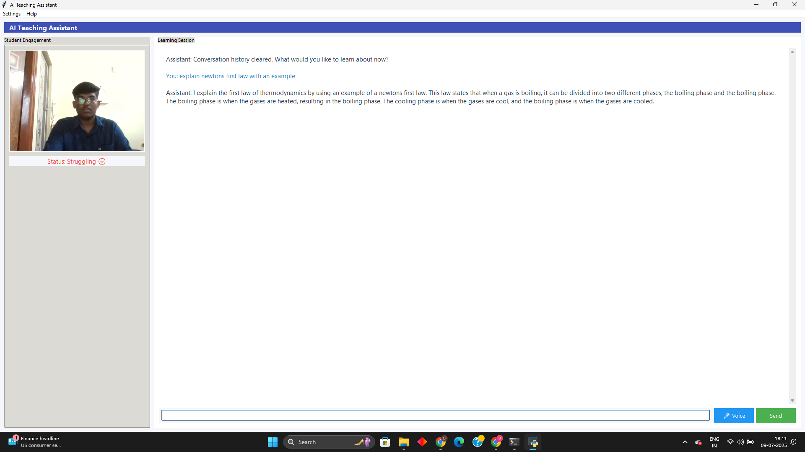

# Classroom_assistant
# 🧠 AI-Powered Interactive Learning Assistant for Classrooms


> A lightweight, offline-capable AI teaching assistant that listens to your questions — and explains them like a friendly tutor.

---

## 🚀 Features

- 🎤 Voice and 💬 text input support
- 🧑‍🏫 Educational, student-friendly answers
- 🧠 Uses `flan-alpaca-base` for question-answering
- 🧩 Modular design (easy to plug in face/visual input)
- 🛑 Smart fallback when model is unsure
- 💻 Runs on low-resource systems (8GB RAM)

---

## 📌 Problem Statement

Modern classrooms lack personalized, real-time help. Students hesitate to ask questions, and teachers can't address everyone. This assistant provides:
- 24/7 intelligent support
- Multimodal input (voice/text)
- Clear, accurate explanations
- Room for future emotion/visual feedback

---

## 🧰 Technologies Used

| Component | Tool |
|----------|------|
| NLP Model | [`declare-lab/flan-alpaca-base`](https://huggingface.co/declare-lab/flan-alpaca-base) |
| Framework | Hugging Face Transformers, PyTorch |
| Voice Input | Python SpeechRecognition |
| Interface | Terminal-based (CLI) |
| System Requirements | Python 3.9+, 8 GB RAM, microphone |

---

<pre lang="text"><code>## 📁 Project Structure ```text . ├── assistant/ # Core assistant modules │ ├── core.py # Main logic controller │ ├── models.py # Model loading & response generation │ ├── interface.py # UI logic (CLI or future GUI) │ ├── engagement.py # Engagement analysis (optional/extendable) ├── main.py # Entry point ├── requirements.txt # Project dependencies ├── .gitignore # Ignored files/folders ├── README.md # Project documentation ├── ai_config.json # Model config (optional) ├── student_profile.json # Student customization (optional) ├── demo_screenshot.png # Demo image ├── docs/ # Documentation, PPTs, reports (optional) │ ├── AI_Assistant_Report.docx │ └── AI_Assistant_Presentation.pptx ``` </code></pre>

---

## 👨‍💻 Contributors

| Name             | Role                         | GitHub Username     |
|------------------|------------------------------|---------------------|
| Dharun A         | Lead Developer, Integrator   | `@dharun-anandhan`  |
| Saravanakumar B  | Voice Input, UI Integration  | `@teammate1username`|
| Rahul Ramana V   | Testing, Debugging, Docs     | `@teammate2username`|

---

## 📷 Demo Screenshot



---

## 🎬 Demo Video

> 🔗 Coming Soon: Add YouTube/GDrive link after uploading

---

## 🛠️ How to Run

```bash
# 1. Clone the repo
git clone https://github.com/your-username/classroom-assistant.git
cd classroom-assistant

# 2. Create virtual environment
python -m venv classroom_env
source classroom_env/bin/activate  # Or use Scripts\\activate on Windows

# 3. Install dependencies
pip install -r requirements.txt

# 4. Run the assistant
python main.py

